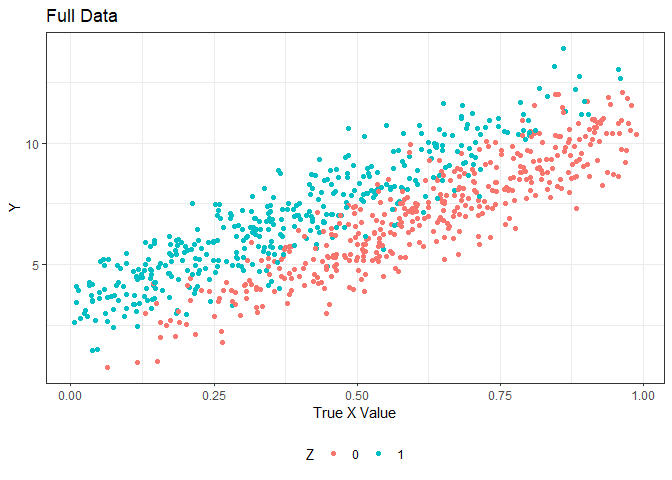
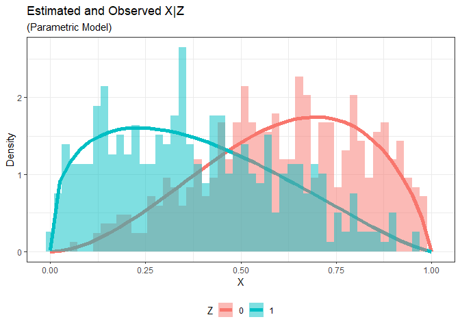
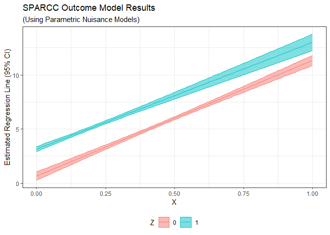
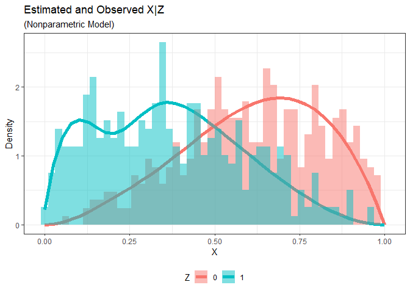
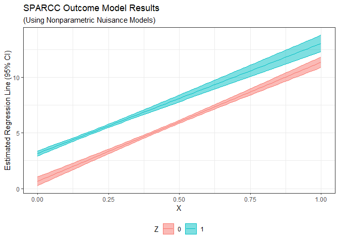

# sparcc: semiparametric censored covariate estimation 

Brian Richardson

## Installation

The `sparcc` package can be loaded locally using the `devtools` package.

``` r
## load the package
library(devtools)
load_all()

## other necessary packages
library(dplyr)
library(ggplot2)
library(statmod)
```

The `sparcc` package contains functions to analyze data with a randomly
right-censored covariate using the SPARCC (or “semiparametric censored
covariate”) estimator.

The methods implemented are introduced in the paper, “SPARCC:
Semi-Parametric Robust Estimation in a Right-Censored Covariate Model,”
which is currently under revision. A pre-print can be found here:
<https://arxiv.org/abs/2409.07795>.

The code implemented in this package is specific to the scenario where
$Y|X,Z$ has a normal distribution with mean
$\textrm{E}(Y|X,Z)=\beta_0+\beta_1X+\beta_2Z + \beta_3XZ$, for a
censored covariate $X$ and an uncensored discrete-valued covariate $Z$.

## Tutorial

Below is a tutorial for how the SPARCC estimator can be used on a data
set with a censored covariate.

### Data Generation

We first need to simulate a data set with a censored covariate. This
data generation can be done, for example, using the built in
`gen.data.beta` function in the `sparcc` package.

The `gen.data.beta` function generates the following variables: \*
$Z \sim \textrm{Bernoulli}(0.5)$, a binary fully observed covariate, \*
$X$, a censored covariate with
$X|Z \sim \textrm{beta}(\alpha_{11} + \alpha_{12}Z, \alpha_{13} + \alpha_{14}Z)$,
\* $C$, the censoring variable with
$C|Z \sim \textrm{beta}(\alpha_{21} + \alpha_{22}Z, \alpha_{23} + \alpha_{24}Z)$,
\* $Y$, the outcome with
$Y|X,Z \sim \textrm{Normal}(\beta_0 + \beta_1X + \beta_2Z, \sigma^2)$.

To ensure that $X$ and $C$ are generated with the desired censoring
proportion $q=P(X>C)$, the following reparametrization is used within
the `gen.data.beta` function:

$$
\begin{bmatrix}
\alpha_{11} \\
\alpha_{12} \\
\alpha_{13} \\
\alpha_{14}
\end{bmatrix} =
\begin{bmatrix}
1 + \gamma_x - \theta_{x1} \\
\theta_{x1} - \theta_{x2} \\
1 + \gamma_x + \theta_{x1} \\
-\theta_{x1} + \theta_{x2}
\end{bmatrix}
$$ $$
\begin{bmatrix}
\alpha_{21} \\
\alpha_{22} \\
\alpha_{23} \\
\alpha_{24}
\end{bmatrix} =
\begin{bmatrix}
1 + \gamma_c - \theta_{c1} \\
\theta_{c1} - \theta_{c2} \\
1 + \gamma_c + \theta_{c1} \\
-\theta_{c1} + \theta_{c2}
\end{bmatrix}
$$

The user specifies desired values for
$\gamma_x, \gamma_c, \theta_{x1}, \theta_{x2}$ along with a desired
censoring proportion $q$. The `gen.data.beta` function then finds an
appropriate $\theta_{c1}, \theta_{c2}$ in order to satisfy the
constraint $q=\textrm{P}(X>C)$.

From the complete data $(Y, X, C, Z)$, the observed data
$(Y, W, \Delta, Z)$ are generated using $W = \min(X, C)$ and
$\Delta = I(X \leq C)$.

The `gen.data.beta` function returns a list of four data frames:

1)  `datf`: The full data, including the outcome `Y`, the covariate `X`,
    and the censoring time `C`.
2)  `dat`: The observed data, including the outcome `Y`, the possibly
    censored covariate `W`, and the censoring indicator `Delta`.
3)  `dat0`: The oracle data, a version of the observed data where no
    observations are censored (essentially setting `C` equal to infinity
    for all observations).
4)  `datcc`: The complete case data, or the subset of `dat` with
    `Delta == 1`.

``` r
## define parameters
set.seed(123)                 # random number seed for reproducibility
n <- 800                      # sample size
q <- 0.6                      # censoring proportion
B <- c(1, 10, 2)              # outcome model parameters
s2 <- 1                       # Var(Y|X,Z)
x.thetas <- 0.5 * c(-1, 1)    # parameters governing X|Z and C|Z
x.gamma <- 1
c.gamma <- 2

## generate data
dat.list <- gen.data.beta(
  n = n, q = q, B = B, s2 = s2,
  x.thetas = x.thetas, x.gamma = x.gamma, c.gamma)
datf <- dat.list$datf          # full data
dat0 <- dat.list$dat0          # oracle data
dat <- dat.list$dat            # observed data
datcc <- dat.list$datcc        # complete case data
zs <- sort(unique(dat$Z))      # unique z values
```

We can visualize the full and observed data below.

``` r
## plot full data
datf %>% 
  ggplot(aes(x = X,
             y = Y, 
             color = factor(Z))) +
  geom_point() +
  labs(x = "True X Value",
       color = "Z",
       title = "Full Data") +
  theme_bw() +
  theme(legend.position = "bottom")
```

<!-- -->

``` r
## plot observed data
dat %>% 
  ggplot(aes(x = W,
             y = Y, 
             color = factor(Z))) +
  geom_point() +
  labs(x = "Observed W = min(X, Delta)",
       color = "Z",
       title = "Observed Data") +
  theme_bw() +
  theme(legend.position = "bottom")
```

<!-- -->

### Estimation

Using the observed data, we can fit the SPARCC estimator using the
`sparcc` function. The SPARCC estimator can be obtained by either (i)
using parametric working models for the nuisance distributions for $X|Z$
and $C|Z$, or (ii) using nonparametric models for the nuisance
distributions.

#### Parametric Working Models

To use the SPARCC estimator with parametric working models, use the
`nuisance.models = "parametric"` option.

Then supply the posited parametric working models for $X$ and $C$ using
the `distr.x` and `distr.c` options, respectively. Each should be a
character string `"name"` naming a distribution for which the
corresponding density function `dname` is defined. For example, the
default is `"beta"`, for which the density `dbeta` is defined in base R.
It is assumed that $X$ (and $C$) then follow these posited distributions
with possibly different parameter values at each level of $Z$.

Importantly, this implementation of the SPARCC estimator is consistent
and asymptotically normal provided at least one of these two model
specifications is correct.

The following additional function arguments have default values, but are
included in the function call below for the sake of this tutorial: \*
`xz.interaction`: a logical indicator for whether an `X*Z` interaction
is to be included in the outcome model (`TRUE`) or not (`FALSE`), \*
`mx`: a positive integer, the number of quadrature nodes used for `X`,
\* `mc`: a positive integer, the number of quadrature nodes used for
`C`, \* `my`: a positive integer, the number of Gauss-Hermite quadrature
nodes used for $Y$, \* `range.x`: a numeric vector of length 2, the
range of the support of `X`, \* `range.c`: a numeric vector of length 2,
the range of the support of `C`.

``` r
sparcc.param <- sparcc(
  data = dat,
  xz.interaction = T,
  nuisance.models = "parametric",
  distr.x = "beta",
  distr.c = "beta",
  mx = 40,
  mc = 40,
  my = 5,
  range.x = c(1E-6, 1-1E-6),
  range.c = c(1E-6, 1-1E-6), 
)
```

    ## STEP 1: fit parametric nuisance models

    ## STEP 1 complete (0.33 seconds)

    ## STEP 2: obtain SPARCC estimator

    ## STEP 2 complete (92.29 seconds)

    ## STEP 3: obtain SPARCC variance estimator

    ## STEP 3 complete (28.37 seconds)

The `sparcc` function returns a list with three items: `x.model`,
`c.model`, and `outcome.model`, which are themselves lists with results
for the $X|Z$ nuisance model, the $C|Z$ nuisance model, and the $Y|X,Z$
outcome model, respectively.

The `x.model` and `c.model` lists contain the estimated density
functions for these two distributions at their quadrature nodes (`eta1`
and `eta2`). With the parametric working model implementation (i.e., if
`nuisance.models = "parametric"`), the `x.model` and `c.model` lists
also contain the posited distributional families (`distr.x` and
`distr.c`) and estimated parameters (`x.params.hat` and `c.params.hat`).

As a demonstration, we can assess here how well the posited beta
distribution for $X|Z$ fits the data. (Note that in reality, we would
not observe most of these $X$ values due to right-censoring.)

``` r
## extract estimated X|Z density
eta1 <- sparcc.param$x.model$eta1

## plot full data vs estimated density of X|Z
ggplot(data = NULL) +
  geom_line(data = eta1,
            aes(x = x.nds,
                y = eta1,
                color = factor(Z)),
            linewidth = 2) +
  geom_histogram(data = datf,
                 aes(x = X,
                     y = after_stat(density),
                     group = factor(Z),
                     fill = factor(Z)),
                 position = "identity",
                 alpha = 0.5,
                 bins = 50) +
  labs(x = "X",
       y = "Density",
       title = "Estimated and Observed X|Z",
       subtitle = "(Parametric Model)",
       fill = "Z",
       color = "Z") +
  theme_bw() +
  theme(legend.position = "bottom")
```

<!-- -->

The `outcome.model` list contains the outcome model formula, the
estimated model coefficients, and the covariance matrix for these
coefficients.

``` r
## outcome model formula
sparcc.param$outcome.model$outcome.fmla
```

    ## Y ~ X * Z
    ## <environment: 0x00000193b38450b0>

``` r
## estimated coefficient; truth is c(1, 10, 2, 0, 0)
sparcc.est <- sparcc.param$outcome.model$coef
round(sparcc.est, 3)
```

    ##     B1     B2     B3     B4     B5 
    ##  0.659 10.689  2.502 -0.830 -0.144

``` r
## covariance matrix
sparcc.cov <- sparcc.param$outcome.model$cov
round(sparcc.cov, 3)
```

    ##        [,1]   [,2]   [,3]   [,4]   [,5]
    ## [1,]  0.040 -0.078 -0.040  0.078  0.000
    ## [2,] -0.078  0.173  0.078 -0.174  0.000
    ## [3,] -0.040  0.078  0.055 -0.123 -0.001
    ## [4,]  0.078 -0.174 -0.123  0.397  0.003
    ## [5,]  0.000  0.000 -0.001  0.003  0.006

We can use these estimated coefficients and corresponding covariance
matrix to plot the regression line of $Y$ on $X$ and $Z$, along with a
corresponding 95% confidence interval.

``` r
## new X and Z data for fitting the regression model
Xnew <- data.frame(
  int = 1,
  X = seq(0, 1, length = 100),
  Z = rep(0:1, each = 100)) %>% 
  mutate(XZ = X * Z) %>% 
  as.matrix()

## fitted values
Yhat <- Xnew %*% sparcc.est[1:4]

## standard errors for fitted values
Yhat.se <- sqrt(diag(Xnew %*% sparcc.cov[1:4, 1:4] %*% t(Xnew)))

## data for plotting
plot.dat <- data.frame(
  X = Xnew[,2],
  Z = factor(Xnew[,3]),
  Yhat = Yhat,
  Ylower = Yhat - qnorm(0.975) * Yhat.se,
  Yupper = Yhat + qnorm(0.975) * Yhat.se)

## plot fitted lines and 95% confidence intervals
ggplot(data = plot.dat,
       aes(x = X,
           y = Yhat,
           ymin = Ylower,
           ymax = Yupper,
           color = Z,
           fill = Z)) +
  geom_line() +
  geom_ribbon(alpha = 0.5) +
  labs(x = "X",
       y = "Estimated Regression Line (95% CI)",
       color = "Z",
       fill = "Z",
       title = "SPARCC Outcome Model Results",
       subtitle = "(Using Parametric Nuisance Models)") +
  theme_bw() +
  theme(legend.position = "bottom")
```

<!-- -->

#### Nonparametric Models

To use the SPARCC estimator with nonparametric nuisance models, use the
`nuisance.models = "nonparametric"` option.

Under this option, the distributions of $X|Z$ and $C|Z$ are fit using a
nonparametric B-spline estimator. Instead of supplying posited
parametric distributions, specify the polynomial degree and number of
spline knots using the `deg` and `m.knots` arguments.

``` r
sparcc.nonpar <- sparcc(
  data = dat,
  xz.interaction = T,
  nuisance.models = "nonparametric",
  deg = 3,
  m.knots = 5,
  mx = 40,
  mc = 40,
  my = 5,
  range.x = c(1E-6, 1-1E-6),
  range.c = c(1E-6, 1-1E-6), 
)
```

    ## STEP 1: fit nonparametric nuisance models

    ## STEP 1 complete (2.03 seconds)

    ## STEP 2: obtain SPARCC estimator

    ## STEP 2 complete (76.78 seconds)

    ## STEP 3: obtain SPARCC variance estimator

    ## STEP 3 complete (30.03 seconds)

The output is a list containing `x.model`, `c.model`, and
`outcome.model`, similar to that for the parametric working model
implementation. We can again assess the fit of the B-spline estimator of
the density of $X|Z$.

``` r
## extract nonparametrically estimated X|Z density
eta1.np <- sparcc.nonpar$x.model$eta1

## plot full data vs estimated density of X|Z
ggplot(data = NULL) +
  geom_line(data = eta1.np,
            aes(x = x.nds,
                y = eta1,
                color = factor(Z)),
            linewidth = 2) +
  geom_histogram(data = datf,
                 aes(x = X,
                     y = after_stat(density),
                     group = factor(Z),
                     fill = factor(Z)),
                 position = "identity",
                 alpha = 0.5,
                 bins = 50) +
  labs(x = "X",
       y = "Density",
       title = "Estimated and Observed X|Z",
       subtitle = "(Nonparametric Model)",
       fill = "Z",
       color = "Z") +
  theme_bw() +
  theme(legend.position = "bottom")
```

<!-- -->

Finally, we can extract the estimated outcome model coefficients and
corresponding covariance matrix, and plot the regression line of $Y$ on
$X$ and $Z$.

``` r
## estimated coefficient; truth is c(1, 10, 2, 0, 0)
sparcc.est.np <- sparcc.nonpar$outcome.model$coef
round(sparcc.est.np, 3)
```

    ##     B1     B2     B3     B4     B5 
    ##  0.658 10.693  2.502 -0.814 -0.144

``` r
## covariance matrix
sparcc.cov.np <- sparcc.nonpar$outcome.model$cov
round(sparcc.cov.np, 3)
```

    ##        [,1]   [,2]   [,3]   [,4]   [,5]
    ## [1,]  0.040 -0.078 -0.040  0.078  0.000
    ## [2,] -0.078  0.173  0.078 -0.173  0.000
    ## [3,] -0.040  0.078  0.055 -0.122 -0.001
    ## [4,]  0.078 -0.173 -0.122  0.390  0.003
    ## [5,]  0.000  0.000 -0.001  0.003  0.006

``` r
## fitted values
Yhat.np <- Xnew %*% sparcc.est.np[1:4]

## standard errors for fitted values
Yhat.se.np <- sqrt(diag(Xnew %*% sparcc.cov.np[1:4, 1:4] %*% t(Xnew)))

## data for plotting
plot.dat.np <- data.frame(
  X = Xnew[,2],
  Z = factor(Xnew[,3]),
  Yhat = Yhat.np,
  Ylower = Yhat.np - qnorm(0.975) * Yhat.se.np,
  Yupper = Yhat.np + qnorm(0.975) * Yhat.se.np)

## plot fitted lines and 95% confidence intervals
ggplot(data = plot.dat.np,
       aes(x = X,
           y = Yhat,
           ymin = Ylower,
           ymax = Yupper,
           color = Z,
           fill = Z)) +
  geom_line() +
  geom_ribbon(alpha = 0.5) +
  labs(x = "X",
       y = "Estimated Regression Line (95% CI)",
       color = "Z",
       fill = "Z",
       title = "SPARCC Outcome Model Results",
       subtitle = "(Using Nonparametric Nuisance Models)") +
  theme_bw() +
  theme(legend.position = "bottom")
```

<!-- -->

## Workflow

### Simulations

The four simulation studies for the paper accompanying this R package
can all be reproduced using the code in `simulations/`. For each of
these four simulation studies (`x = 1,2,3,4`), the following exist:

- `simx_function.R`: An R script defining a function to run a single
  simulation.  
- `simx_run.R`: An R script to run repeated simulations in parallel on a
  computing cluster using a variety of desired settings.  
- `simx_data/`: A folder containing simulation results produced by
  running `simx_run.R` on a computing cluster.
- `simx_analyze.Rmd`: An R Markdown report to analyze the results from
  the simulation study (found in `simx_data/`).

Simulation figures are output to the folder `sim_plots/`.

### Synthetic Data Analysis

The workflow used to analyze the ENROLL-HD dataset in the accompanying
paper is replicated in the folder `fake_data_analysis/`, but using
synthetic data. Details and a data dictionary are provided in
`fake_data_analysis/00-FakeData-Dictionary.Rmd`.

The entire synthetic data analysis can be reproduced by running the
following R scripts in order:

- `01-FakeData-Generation.R`  
- `02-FakeData-Analysis-TMS.R`  
- `03-FakeData-Analysis-SDMT.R`  
- `04-FakeData-Analysis-cUHDRS.R`  
- `05-FakeData-Results.R`
